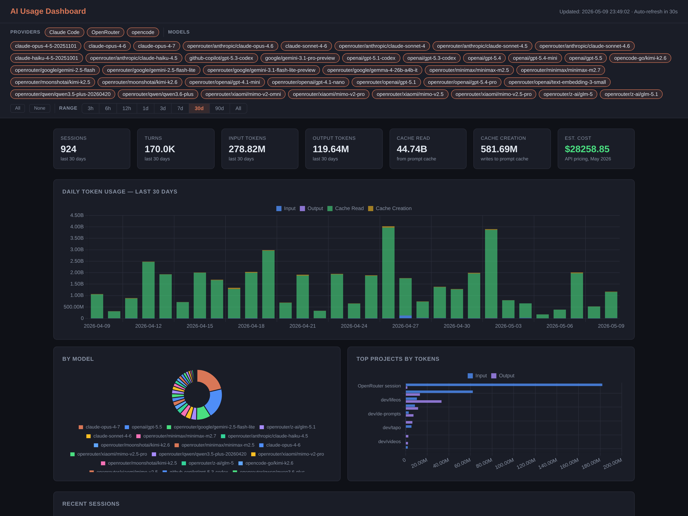

# AI Usage Dashboard

[](LICENSE)

> A fork of [phuryn/claude-usage](https://github.com/phuryn/claude-usage) extended with **opencode** and **OpenRouter** as additional data sources, provider tagging, sub-day time ranges, pagination, and authoritative cost reporting where the upstream provider exposes it.

A local dashboard that pulls together usage from every coding-agent tool you use — Claude Code, opencode, and OpenRouter — into one SQLite-backed view with charts, per-model cost, per-provider filters, and per-session history.



---

## What this tracks

| Source | How it's read | Cost basis |
|---|---|---|
| **Claude Code** (CLI, VS Code extension, dispatched sessions) | Local JSONL transcripts in `~/.claude/projects/` | Anthropic API list pricing |
| **opencode** | Local SQLite DB at `~/.local/share/opencode/opencode.db` | Upstream provider list pricing (OpenAI, Google, Moonshot, …) |
| **OpenRouter** | `GET /api/v1/activity` (last 30 UTC days) | OpenRouter's reported `usage` USD |

**Not captured:**
- Cowork / server-side Claude sessions (no local transcripts)
- OpenRouter activity older than ~30 days that wasn't scanned in time (the API only returns the last 30 completed UTC days; data captured locally persists indefinitely)

---

## Requirements

- Python 3.8+
- No third-party packages — uses only the standard library (`sqlite3`, `http.server`, `urllib`, `json`, `pathlib`)

---

## Quick start

```bash
git clone https://github.com/kierandrewett/ai-usage
cd ai-usage
python3 cli.py dashboard
```

Opens the dashboard at <http://localhost:8080> after running a scan.

### OpenRouter (optional)

OpenRouter is cloud-only — there's no local DB to scrape, so the scanner calls `GET /api/v1/activity`.

> [!IMPORTANT]
> **A regular OpenRouter inference API key (`sk-or-v1-…`) will not work.** The activity endpoint requires a **provisioning key** (a.k.a. management key) with analytics-read scope. Inference keys return `401 User not found`.
>
> Generate one at <https://openrouter.ai/settings/provisioning-keys> — it's a separate key type from the keys you use to call models.

Drop the provisioning key in a `.env` file in the repo root:

```
OPENROUTER_API_KEY=<your provisioning key>
```

`.env` is gitignored. The scan skips OpenRouter cleanly if the key isn't set, and surfaces the `401` body if you accidentally use the wrong key type.

Other limits inherited from the API:
- Only the **last 30 completed UTC days** are returned. Data captured locally persists indefinitely, so periodic scanning gives you a long history.
- Granularity is daily per `(model, endpoint)` — there's no per-request enumeration.

---

## Usage

```bash
# Scan all sources and update the database (~/.claude/usage.db)
python3 cli.py scan

# Today's usage summary in the terminal
python3 cli.py today

# All-time stats in the terminal
python3 cli.py stats

# Scan + open the browser dashboard
python3 cli.py dashboard
```

The Claude Code and opencode scanners are incremental (track per-file mtime / per-session updated-at). OpenRouter's daily rollups are wiped+reinserted per-(date, model, endpoint) on each scan so today's growing numbers stay correct.

---

## How it works

```
┌─ Claude Code JSONLs ─┐
│  opencode.db         │──▶ scanner.py / opencode_scanner.py / openrouter_scanner.py
│  OpenRouter /activity│         │
└──────────────────────┘         ▼
                          ~/.claude/usage.db (SQLite)
                                 │
                                 ▼
                          dashboard.py (localhost:8080)
```

The `sessions` table has a `source` column ("claude-code" / "opencode" / "openrouter") that drives the Provider tag and per-provider filter. Where a source reports authoritative cost (OpenRouter), it's stored in `actual_cost_usd` and the dashboard prefers it over token-based estimates.

---

## Cost estimates

| Source | Pricing approach |
|---|---|
| Claude Code | Anthropic API list rates as of June 2026 — see [claude.com/pricing#api](https://claude.com/pricing#api). Subscribers on Pro/Max have a different (subscription-based) actual cost structure. |
| opencode | List rates for the upstream provider (OpenAI, Google, Moonshot, etc.). These are approximate and may need updating as providers change pricing — edit `PRICING` in `dashboard.py`. |
| OpenRouter | OpenRouter's own reported `usage` field (paid + BYOK inference) — shown verbatim, no client-side computation. |

For sources that go through subscription billing (GitHub Copilot via opencode, Pro/Max via Claude Code), the displayed "cost" is the **API-equivalent** — what you would have paid at metered list pricing. Your actual subscription bill will differ.

---

## Files

| File | Purpose |
|------|---------|
| `scanner.py` | Parses Claude Code JSONLs, writes to `~/.claude/usage.db` |
| `opencode_scanner.py` | Reads opencode's SQLite DB into the same usage.db |
| `openrouter_scanner.py` | Pulls OpenRouter daily activity rollups (requires `OPENROUTER_API_KEY`) |
| `dashboard.py` | HTTP server + single-page HTML/JS dashboard |
| `cli.py` | `scan`, `today`, `stats`, `dashboard` commands |

---

## Credit

Forked from [phuryn/claude-usage](https://github.com/phuryn/claude-usage), originally created by [The Product Compass Newsletter](https://www.productcompass.pm). MIT licensed.
